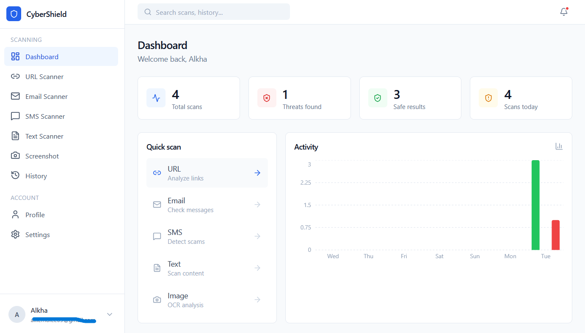
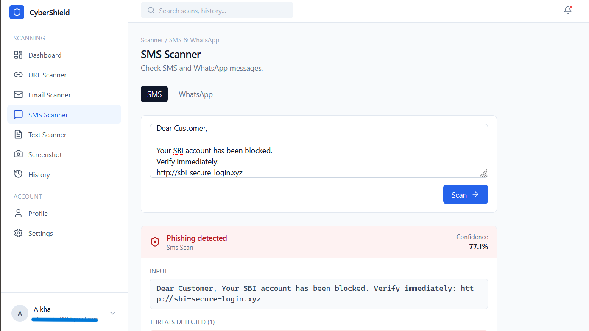
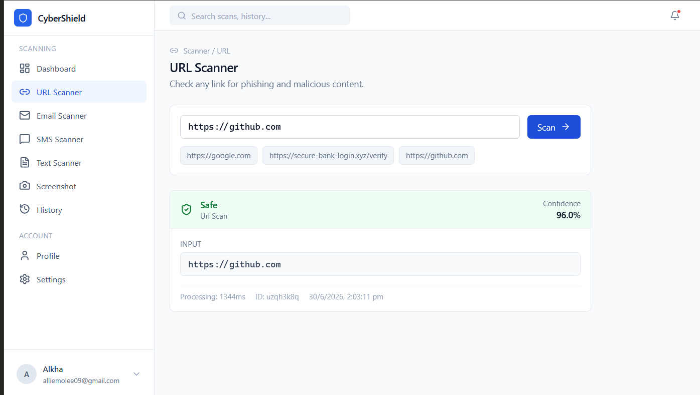
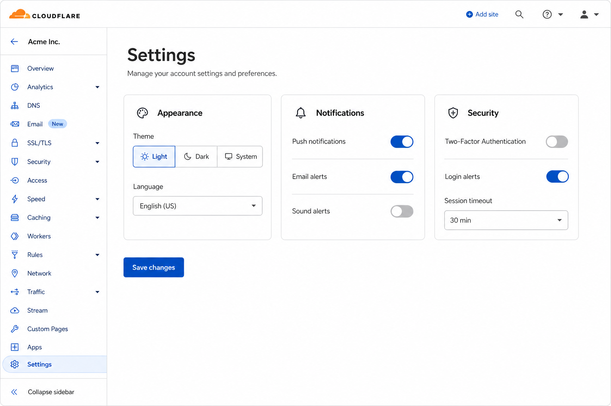

# CyberShield AI

> Enterprise-grade phishing detection platform. Scan URLs, emails, SMS, text, and screenshots for security threats using machine learning.

[](https://react.dev)
[](https://spring.io)
[](https://fastapi.tiangolo.com)
[](https://mysql.com)
[](https://docker.com)

---

## Overview

CyberShield AI is a full-stack security application that detects phishing attempts across multiple channels. It combines a React frontend, Spring Boot backend, MySQL database, and Python ML service into a production-ready system deployable via Docker Compose.

---

## Screenshots

### Dashboard


### SMS Scanner


### URL Scanner


### Scan Results


### History


### Settings


---


---

## Features

- **Multi-Channel Detection** — URL, Email, SMS/WhatsApp, Text, Screenshot OCR
- **Real-Time Analysis** — Sub-second scan results with confidence scoring
- **User Accounts** — Registration, login, JWT authentication, profile management
- **Scan History** — Persistent per-user history with search, filter, and export
- **Enterprise UI** — Clean, professional interface inspired by Cloudflare, Linear, Vercel
- **Dark/Light Mode** — Theme switching with system preference detection
- **Responsive Design** — Works on desktop, tablet, and mobile

---

## Tech Stack

| Layer | Technology |
|-------|-----------|
| Frontend | React 19, TypeScript, Vite, Tailwind CSS, Recharts, Lucide React |
| Backend | Spring Boot 3.2, Java 17, JWT, Spring Security, JPA/Hibernate |
| Database | MySQL 8.0 |
| ML Service | Python 3.11, FastAPI |
| DevOps | Docker, Docker Compose, Nginx |

---

## Quick Start

### Prerequisites
- Docker & Docker Compose
- 4GB+ RAM available

### Deploy

```bash
# 1. Clone
git clone https://github.com/yourusername/cybershield-ai.git
cd cybershield-ai

# 2. Configure
cp .env.example .env
# Edit .env with your secrets

# 3. Start everything
docker compose up -d --build

# 4. Wait 30-60 seconds for services to start

# 5. Access
# Frontend:  http://localhost
# Backend:   http://localhost:8080/api/health
# ML:        http://localhost:8000/api/health
```

### Stop

```bash
docker compose down
```

---

## Project Structure

```
cybershield-ai/
├── src/                          # React frontend
│   ├── api/client.ts             # HTTP client with backend/local fallback
│   ├── components/               # Layout, ScanResult, ScanningAnimation
│   ├── context/                  # AuthContext, ScanContext (dual-mode)
│   ├── ml/phishingDetector.ts    # Detection engine with API fallback
│   ├── pages/                    # Dashboard, scanners, history, settings
│   └── types/                    # TypeScript interfaces
├── backend/
│   ├── spring-boot/              # Spring Boot API
│   │   ├── src/main/java/com/cybershield/
│   │   │   ├── entity/           # User, ScanResult JPA entities
│   │   │   ├── controller/       # REST API controllers
│   │   │   ├── service/          # Business logic
│   │   │   ├── security/         # JWT, filters, config
│   │   │   └── dto/              # Request/response DTOs
│   │   └── Dockerfile
│   └── python-ml/                # Python ML service
│       ├── main.py               # FastAPI prediction endpoints
│       └── Dockerfile
├── docker-compose.yml            # Full stack orchestration
├── Dockerfile                    # Frontend Nginx build
├── nginx.conf                    # Reverse proxy config
└── .env.example                  # Environment template
```

---

## Database Schema

```sql
-- Users table
CREATE TABLE users (
  id VARCHAR(36) PRIMARY KEY,
  name VARCHAR(255) NOT NULL,
  email VARCHAR(255) NOT NULL UNIQUE,
  password VARCHAR(255) NOT NULL,
  role ENUM('USER','ADMIN') DEFAULT 'USER',
  created_at TIMESTAMP DEFAULT CURRENT_TIMESTAMP,
  updated_at TIMESTAMP DEFAULT CURRENT_TIMESTAMP ON UPDATE CURRENT_TIMESTAMP,
  last_login TIMESTAMP NULL
);

-- Scan results table
CREATE TABLE scan_results (
  id VARCHAR(36) PRIMARY KEY,
  user_id VARCHAR(36) NOT NULL,
  type ENUM('URL','EMAIL','SMS','WHATSAPP','TEXT','SCREENSHOT') NOT NULL,
  input TEXT NOT NULL,
  result ENUM('SAFE','SUSPICIOUS','PHISHING','MALICIOUS') NOT NULL,
  confidence DOUBLE NOT NULL,
  threats TEXT,
  details TEXT,
  processing_time INT,
  created_at TIMESTAMP DEFAULT CURRENT_TIMESTAMP,
  FOREIGN KEY (user_id) REFERENCES users(id) ON DELETE CASCADE
);
```

---

## ML Training Pipeline

Models are trained on the following datasets:

| Model | Dataset | Algorithm |
|-------|---------|-----------|
| URL Phishing | `phisingdata.xlsx` | Random Forest + XGBoost Ensemble |
| Email Phishing | `phishing_email.xlsx`, `Enron.xlsx`, `Nazario.xlsx`, `CEAS_08.xlsx`, `SpamAssassin.xlsx` | BERT + SVM Classifier |
| SMS/WhatsApp | `spam.xlsx` | LSTM + Attention Model |
| Scam Detection | `Nigerian_Fraud.xlsx` | BERT Fine-tuned |

Train models:
```bash
cd backend/python-ml
python train_models.py \
  --url_dataset phisingdata.xlsx \
  --email_datasets phishing_email.xlsx Enron.xlsx Nazario.xlsx CEAS_08.xlsx SpamAssassin.xlsx \
  --sms_dataset spam.xlsx \
  --fraud_dataset Nigerian_Fraud.xlsx
```

---

## API Endpoints

### Auth
```
POST /api/auth/register    → Create account
POST /api/auth/login       → Sign in (returns JWT)
GET  /api/auth/me          → Current user
PUT  /api/auth/profile     → Update profile
```

### Scan
```
POST /api/scan/url         → Scan URL
POST /api/scan/email       → Scan email
POST /api/scan/sms         → Scan SMS/WhatsApp
POST /api/scan/text        → Scan text
GET  /api/scan/history     → User scan history
GET  /api/scan/stats       → User statistics
DELETE /api/scan/history   → Clear history
```

### Health
```
GET /api/health            → Service status
```

---

## API Response Examples

### Scan URL
**Request:**
```bash
POST /api/scan/url
Content-Type: application/json
Authorization: Bearer <token>

{ "content": "https://secure-bank-login.xyz/verify" }
```

**Response:**
```json
{
  "id": "scan_1234567890",
  "type": "url",
  "input": "https://secure-bank-login.xyz/verify",
  "result": "phishing",
  "confidence": 0.9432,
  "threats": [
    "No HTTPS encryption",
    "Suspicious top-level domain",
    "Phishing keyword patterns detected"
  ],
  "processingTime": 1245,
  "createdAt": "2024-01-15T10:30:00Z"
}
```

### Auth Login
**Request:**
```bash
POST /api/auth/login
Content-Type: application/json

{ "email": "user@example.com", "password": "password123" }
```

**Response:**
```json
{
  "token": "eyJhbGciOiJIUzI1NiIs...",
  "user": {
    "id": "user-uuid",
    "name": "John Doe",
    "email": "user@example.com",
    "role": "USER",
    "createdAt": "2024-01-01T00:00:00Z"
  }
}
```

---

## Environment Variables

```env
# Database
DB_ROOT_PASSWORD=rootpassword
DB_NAME=cybershield
DB_USER=cybershield
DB_PASSWORD=cybershield_pass

# JWT (generate: openssl rand -hex 64)
JWT_SECRET=your-64-char-hex-secret
JWT_EXPIRATION=86400000

# Frontend
VITE_API_URL=http://localhost:8080
```

---

## Deployment Options

| Platform | Method | URL |
|----------|--------|-----|
| **Local** | `docker compose up -d` | http://localhost |
| **Railway** | Connect GitHub repo | railway.app |
| **Render** | Connect GitHub repo | render.com |
| **VPS** | Docker Compose on Linux | your-domain.com |

---

## Monitoring

```bash
# Check service status
docker compose ps

# View logs
docker compose logs -f backend
docker compose logs -f ml-service

# Restart a service
docker compose restart backend

# Full reset (WARNING: deletes all data)
docker compose down -v
docker compose up -d --build
```

---

## Development

```bash
# Full stack
docker compose up -d

# Frontend only (dev server)
npm run dev

# Backend only
cd backend/spring-boot
./mvnw spring-boot:run

# ML service only
cd backend/python-ml
uvicorn main:app --reload --port 8000
```

---

## License

MIT — Educational and commercial use permitted.

---

**CyberShield AI** — Protecting users from phishing with machine learning.
