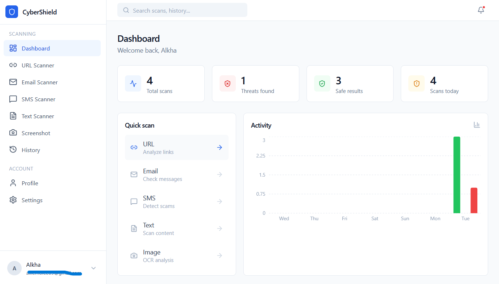
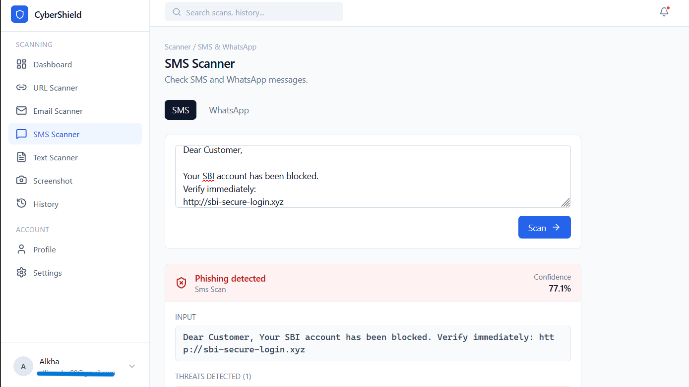
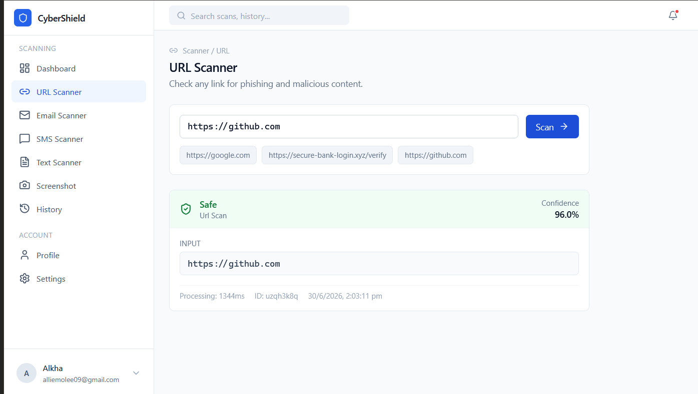
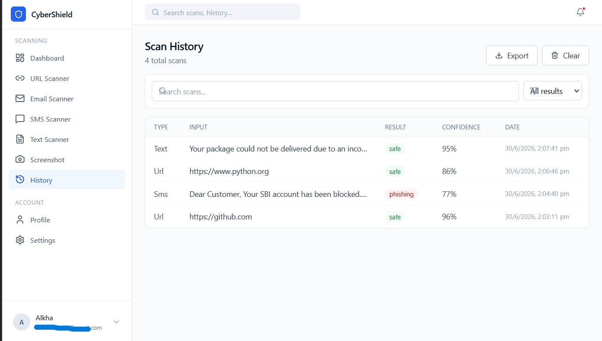

# CyberShield 

> Enterprise-grade phishing detection platform. Scan URLs, emails, SMS, text, and screenshots for security threats using machine learning.

[](https://react.dev)
[](https://spring.io)
[](https://fastapi.tiangolo.com)
[](https://mysql.com)
[](https://docker.com)

---

## Overview

CyberShield AI is a full-stack security application that detects phishing attempts across multiple channels. It combines a React frontend, Spring Boot backend, MySQL database, and Python ML service into a production-ready system deployable via Docker Compose.

---

## Screenshots

### Dashboard


### SMS Scanner


### URL Scanner


### History


---

## Features

- **Multi-Channel Detection** — URL, Email, SMS/WhatsApp, Text, Screenshot OCR
- **Real-Time Analysis** — Sub-second scan results with confidence scoring
- **User Accounts** — Registration, login, JWT authentication, profile management
- **Scan History** — Persistent per-user history with search, filter, and export
- **Enterprise UI** — Clean, professional interface inspired by Cloudflare, Linear, Vercel
- **Dark/Light Mode** — Theme switching with system preference detection
- **Responsive Design** — Works on desktop, tablet, and mobile

---

## Tech Stack

| Layer | Technology |
|-------|-----------|
| Frontend | React 19, TypeScript, Vite, Tailwind CSS, Recharts, Lucide React |
| Backend | Spring Boot 3.2, Java 17, JWT, Spring Security, JPA/Hibernate |
| Database | MySQL 8.0 |
| ML Service | Python 3.11, FastAPI |
| DevOps | Docker, Docker Compose, Nginx |

---

## Quick Start

### Prerequisites
- Docker & Docker Compose
- 4GB+ RAM available

### Deploy

```bash
# 1. Clone
git clone https://github.com/yourusername/cybershield-ai.git
cd cybershield-ai

# 2. Configure
cp .env.example .env
# Edit .env with your secrets

# 3. Start everything
docker compose up -d --build

# 4. Wait 30-60 seconds for services to start

# 5. Access
# Frontend:  http://localhost
# Backend:   http://localhost:8080/api/health
# ML:        http://localhost:8000/api/health
```
### Stop

```bash
docker compose down
```

---

## Project Structure

```
cybershield-ai/
├── src/                          # React frontend
│   ├── api/client.ts             # HTTP client with backend/local fallback
│   ├── components/               # Layout, ScanResult, ScanningAnimation
│   ├── context/                  # AuthContext, ScanContext (dual-mode)
│   ├── ml/phishingDetector.ts    # Detection engine with API fallback
│   ├── pages/                    # Dashboard, scanners, history, settings
│   └── types/                    # TypeScript interfaces
├── backend/
│   ├── spring-boot/              # Spring Boot API
│   │   ├── src/main/java/com/cybershield/
│   │   │   ├── entity/           # User, ScanResult JPA entities
│   │   │   ├── controller/       # REST API controllers
│   │   │   ├── service/          # Business logic
│   │   │   ├── security/         # JWT, filters, config
│   │   │   └── dto/              # Request/response DTOs
│   │   └── Dockerfile
│   └── python-ml/                # Python ML service
│       ├── main.py               # FastAPI prediction endpoints
│       └── Dockerfile
├── docker-compose.yml            # Full stack orchestration
├── Dockerfile                    # Frontend Nginx build
├── nginx.conf                    # Reverse proxy config
└── .env.example                  # Environment template
```

## License

MIT — Educational and commercial use permitted.

---

**CyberShield AI** — Protecting users from phishing with machine learning.
